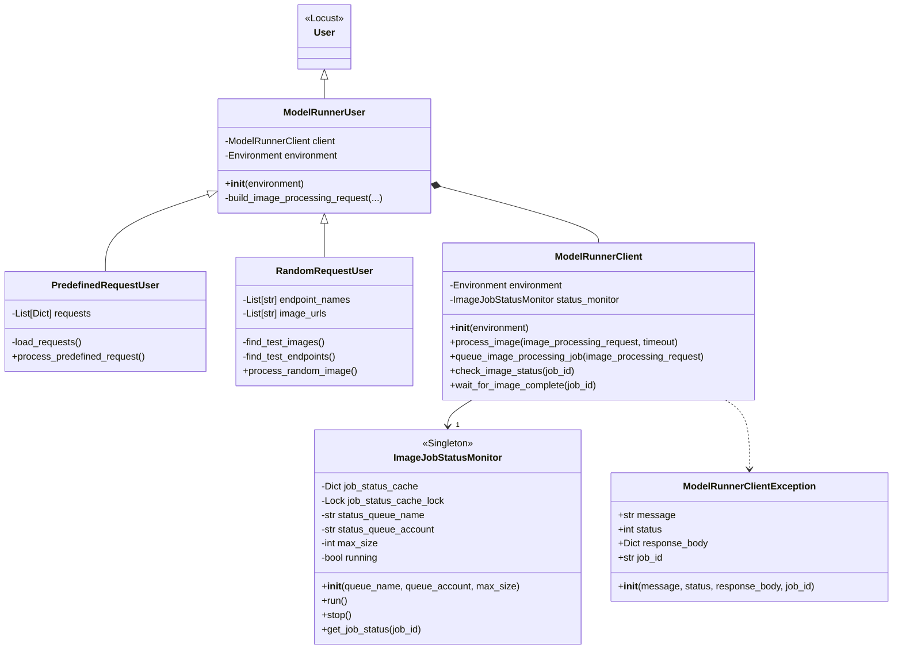
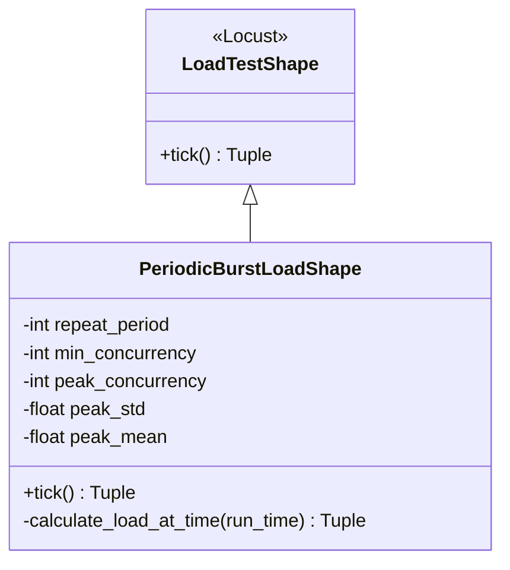

# Locust Load Tests for ModelRunner
This directory contains software necessary to test the OversightML ModelRunner service with Locust.

## Getting Started:
An example Conda environment for running these tests has been provided and can be setup using the following
commands:
```shell
conda env create -f environment-locust.yml
conda activate osml_model_runner_test
```

Once the Conda environment is running you can setup your AWS credentials into the shell and then start the
Locust test environment as shown.
```shell
export AWS_ACCOUNT="..."
locust -f ./bin/locust --class-picker \
  --aws-account ${AWS_ACCOUNT} \
  --test-imagery-location s3://osml-test-images-${AWS_ACCOUNT} \
  --test-results-location s3://mr-bucket-sink-${AWS_ACCOUNT}
```
The parameters shown above are the bare minimum parameters assuming a default installation of ModelRunner. Additional
command line options and the default values are shown below.

| Parameter Name	         | Default           |
|-------------------------|---------------------|
| --aws-region	           | “us-west-2”         |
| --aws-account	       | None                |
| --mr-input_queue	       | “ImageRequestQueue” |
| --mr-status-queue	   | “ImageStatusQueue”  |
| --test-imagery-location | None                |
| --test-results-location | None                |

This directory contains implementations of 2 Locust users that can be used to send different kinds of image processing
requests. The **PredefinedRequestUser** will cycle through requests defined in `bin/locust/sample-requests.json`.
Each request will have its template values filled in from the parameter values before it is sent. The
**RandomRequestsUser** will list all of the TIFF, and NITF files in the S3 bucket, query SageMaker to determine
what endpoints are available and then make requests from each image+endpoint pair chosen randomly.

There is also an implementation of a **PeriodicBurstLoadShape** which can be used to generate a load spike on a
regular basis. That LoadTestShape supports additional configuration options that can be set from the UI or
as command line arguments:

| Parameter Name	         | Default                                 |
|-------------------------|-------------------------------------------|
| --pbls-repeat-period    | 600                                       |
| --pbls-min-concurrency  | 5                                         |
| --pbls-peak-concurrency | 40                                        |
| --pbls-peak-std	       | None                                      |
| --pbls-peak-mean	       | None                                      |

## Implementation Details:

Class diagrams for the users and load shape are shown below. The plan is to continue expanding this baseline to
support additional user behaviors and load shapes as needed. The only thing outside of a typical Locust design
is the ModelRunner job monitoring thread that listens to SQS status messages and then keeps a data structure of
the most recent jobs. This is necessary because multiple independent users will submit jobs but ModelRunner only
sends status updates through a single channel.



